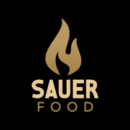
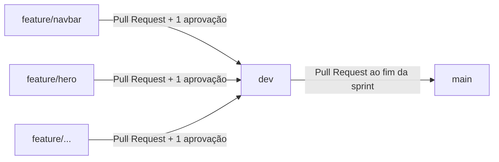

<p align="center">
  
</p>

<h1 align="center">Sauer Food</h1>

<p align="center">
  <em>Experiências gastronômicas feitas sob medida para o seu evento.</em>
</p>

<p align="center">
  
  
  
  
  
</p>

---

## Sumário

- [Sobre o projeto](#sobre-o-projeto)
- [Serviços apresentados no site](#serviços-apresentados-no-site)
- [Funcionalidades e roadmap](#funcionalidades-e-roadmap)
- [Identidade visual](#identidade-visual)
- [Tecnologias](#tecnologias)
- [Estrutura do projeto](#estrutura-do-projeto)
- [Como executar](#como-executar)
- [Fluxo de trabalho](#fluxo-de-trabalho)
- [Como contribuir](#como-contribuir)
- [Equipe](#equipe)
- [Contexto acadêmico](#contexto-acadêmico)
- [Direitos e licença](#direitos-e-licença)

---

## Sobre o projeto

A **Sauer Food** é uma empresa de Foz do Iguaçu (PR) especializada em experiências gastronômicas personalizadas para eventos corporativos, confraternizações, formaturas, casamentos e festas privadas. Diferente do buffet tradicional, atua com formatos dinâmicos e interativos, e cada cardápio é adaptado ao número de convidados, à duração do evento, ao estilo da celebração, às restrições alimentares e ao orçamento do cliente.

Este repositório reúne o **site institucional** da empresa. O objetivo é duplo:

1. **Apresentar a marca** com uma identidade visual sofisticada, alinhada ao preto e dourado da Sauer Food.
2. **Converter visitantes em orçamentos**, levando o cliente do site direto ao WhatsApp da empresa, canal em que a taxa de conversão do negócio já é alta.

O projeto nasceu de uma demanda real, levantada em reunião com o proprietário, e é desenvolvido como Projeto Integrador de Extensão (PIE) da faculdade.

## Serviços apresentados no site

| Serviço | Descrição |
|---|---|
| **Finger Food** | Pequenas porções sofisticadas, consumidas sem pratos ou talheres. Ideal para coquetéis, lançamentos, casamentos e recepções. |
| **Festival de Churrasco** | Experiência completa com preparo ao vivo: costela fogo de chão, cortes especiais, carnes defumadas e estações gastronômicas. |
| **Coffee Break** | Pensado para treinamentos, palestras, congressos e reuniões, em versões leve, tradicional ou reforçada. |
| **Personalização total** | Todos os serviços são montados sob medida, do cardápio ao formato de atendimento. |

## Funcionalidades e roadmap

**Já no site**

- [x] Navbar fixa, com estrutura do seletor de idioma (PT / ES / EN)
- [x] Hero com chamada principal e botões de ação
- [x] Seção institucional ("Unimos Técnica e Paixão")
- [x] Seções de serviços: Finger Food, Churrasco e Coffee Break
- [x] Diferenciais e "Jornada do Sabor"

**Em andamento**

- [ ] Galeria, depoimentos, chamada final (CTA) e rodapé (estrutura criada, conteúdo pendente)

**Planejado**

- [ ] Página de Serviços
- [ ] Página de Eventos (casamentos, formaturas, corporativo e outros)
- [ ] Página de Cardápio
- [ ] Calculadora de orçamento por convidado, com extras fixos e serviços adicionais
- [ ] Envio do orçamento pelo WhatsApp com mensagem pré-formatada (`wa.me`)
- [ ] Botão flutuante "Solicitar Orçamento"
- [ ] Troca de idioma funcional (PT / ES / EN)
- [ ] Layout responsivo (tablet e celular) e menu mobile
- [ ] SEO local e otimização de performance

## Identidade visual

Paleta baseada no logotipo e nos uniformes da equipe: preto e dourado para o churrasco (camisa preta e avental de couro) e tons claros para a cozinha (uniforme branco).

| Token | Valor | Uso |
|---|---|---|
| `--preto` | `black` | Navbar e fundos escuros |
| `--fundo-principal` | `#1f2024` | Fundo das seções |
| `--dourado` | `#8c734b` | Destaques, links em hover, detalhes |
| `--texto-claro` | `#f0f0f2` | Texto sobre fundo escuro |

**Tipografia:** Cormorant Garamond (títulos) e Montserrat (textos das seções).

Os protótipos de alta fidelidade foram criados no Visily e servem de referência visual para a implementação.

## Tecnologias

- **HTML5** e **CSS3** (Flexbox, variáveis CSS, seletores compostos)
- **JavaScript** (interações e, futuramente, a calculadora de orçamento)
- **Git** e **GitHub** para versionamento e revisão de código
- **Trello** para gestão das sprints (Kanban + Scrum)
- **Visily** para prototipação

## Estrutura do projeto

```text
sauerfood/
├── index.html      # Página inicial
├── style.css       # Estilos globais e das seções
├── assets/         # Logotipos, ícones e imagem do hero
├── img/            # Fotografias das seções de serviços
└── README.md
```

## Como executar

O projeto é estático e não exige instalação de dependências.

```bash
# 1. Clone o repositório
git clone https://github.com/WellingtonRafael-LTS/sauerfood.git

# 2. Entre na pasta
cd sauerfood

# 3. Abra o index.html no navegador
```

Para recarregar automaticamente a cada alteração, use a extensão **Live Server** no VS Code (ou o servidor embutido da sua IDE).

## Fluxo de trabalho

A equipe trabalha com **Scrum** em sprints de duas semanas, com o quadro no Trello (Backlog, Sprint Atual, Em Progresso, Revisão e Feito) e revisão do cliente ao final de cada ciclo.

No Git, o repositório segue um fluxo de **feature branches**. As branches `main` e `dev` são protegidas: nenhum commit entra nelas diretamente, e todo merge exige **Pull Request com pelo menos 1 aprovação**.



| Branch | Função |
|---|---|
| `main` | Versão estável, pronta para apresentar ao cliente |
| `dev` | Integração do trabalho de toda a equipe |
| `feature/*` | Uma tarefa por branch, criada a partir da `dev` |

## Como contribuir

```bash
# 1. Atualize a dev local
git fetch
git checkout dev
git pull

# 2. Crie sua branch a partir da dev
git checkout -b feature/nome-da-tarefa

# 3. Trabalhe, faça commits pequenos e descritivos
git add .
git commit -m "feat: adiciona seção de galeria"

# 4. Envie a branch e abra o Pull Request apontando para a dev
git push -u origin feature/nome-da-tarefa
```

**Boas práticas**

- Nomeie a branch de acordo com o card do Trello (`feature/navbar`, `feature/hero`, `feature/pagina-servicos`).
- Escreva mensagens de commit que expliquem o *quê* mudou (`feat:`, `fix:`, `docs:`, `style:`).
- No Pull Request, confira que a **base é `dev`** e descreva o que foi feito.
- Peça revisão de pelo menos uma pessoa antes do merge e resolva conflitos localmente, na sua branch.

## Equipe

| Integrante | Papel | GitHub |
|---|---|---|
| Wellington Rafael Pereira dos Santos | Product Owner e líder da equipe | [@WellingtonRafael-LTS](https://github.com/WellingtonRafael-LTS) |
| Vittor Fernando Sauer | Scrum Master | [@vittorsauer](https://github.com/vittorsauer) |
| Luiz Rodrigo Fabris Lemos | Desenvolvimento | [@LuizLemos25](https://github.com/LuizLemos25) |
| Kauê Santana Pacagnan | Desenvolvimento | <!-- adicionar usuário do GitHub --> |
| João Vitor Peres dos Santos | Desenvolvimento | [@Peressjj](https://github.com/Peressjj) |

## Contexto acadêmico

- **Instituição:** Centro Universitário Descomplica Uniamérica, Foz do Iguaçu (PR)
- **Cursos:** Análise e Desenvolvimento de Sistemas e Engenharia de Software
- **Modalidade:** Projeto Integrador de Extensão (PIE), com demandante externo (Sauer Food)
- **Período:** 2º semestre letivo de 2026 (21 de julho a 11 de dezembro)
- **Professor responsável:** Riad Younes

## Direitos e licença

Projeto acadêmico desenvolvido para fins de aprendizado e regido pelo Termo de Compromisso do PIE firmado entre a Sauer Food, os acadêmicos e a instituição de ensino.

A marca, o logotipo e as fotografias pertencem à **Sauer Food** e não podem ser reutilizados fora do contexto deste projeto.